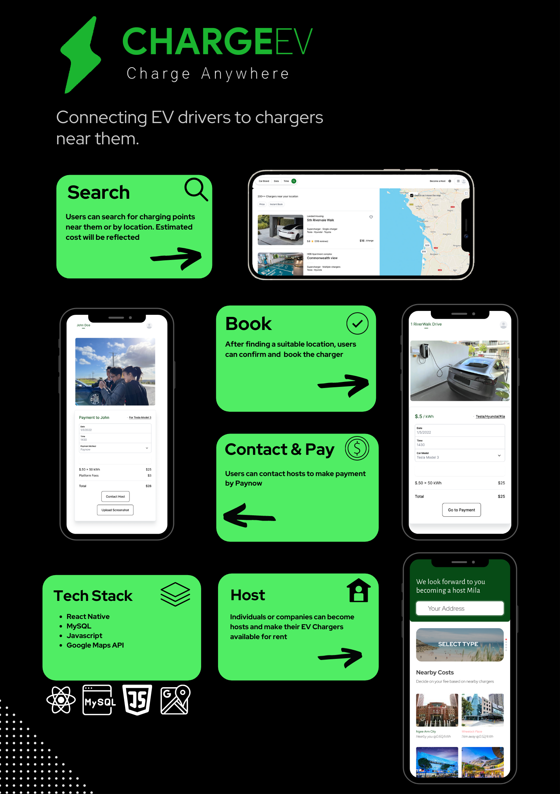

<div id="top"></div>
<!--
*** Thanks for checking out the Best-README-Template. If you have a suggestion
*** that would make this better, please fork the repo and create a pull request
*** or simply open an issue with the tag "enhancement".
*** Don't forget to give the project a star!
*** Thanks again! Now go create something AMAZING! :D
-->


<!-- PROJECT SHIELDS -->
<!--
*** I'm using markdown "reference style" links for readability.
*** Reference links are enclosed in brackets [ ] instead of parentheses ( ).
*** See the bottom of this document for the declaration of the reference variables
*** for contributors-url, forks-url, etc. This is an optional, concise syntax you may use.
*** https://www.markdownguide.org/basic-syntax/#reference-style-links
-->
[![LinkedIn][linkedin-shield]](https://www.linkedin.com/in/jonas-goh-891a15146/)(Jonas)
[![LinkedIn][linkedin-shield]](https://www.linkedin.com/in/tay-jiakang-mila-61a9bb146/)(Mila)


<!-- PROJECT LOGO -->
<br />
<div align="center">
  <a href="https://github.com/github_username/repo_name">
    
  </a>

<h3 align="center">ChargeEV</h3>

  <p align="center">
    ChargeEV is an app that connects Electric Vehicle chargers with hosts that are willing to loan out their chargers.
    <br />
    <a href="https://github.com/jonasgwt/ChargeEV"><strong>Explore the docs »</strong></a>
    <br />
    <br />
    <a href="https://drive.google.com/file/d/1PxCbZpWghce-7rELC49nZX0rGvxPq9iz/view">Project Video</a>
    ·
    <a href="https://github.com/jonasgwt/ChargeEV/issues">Report Bug</a>
    ·
    
    
  </p>
</div>


<!-- TABLE OF CONTENTS -->
<details>
  <summary>Table of Contents</summary>
  <ol>
    <li>
      <a href="#about-the-project">About the project</a>
      <ul>
        <li><a href="#built-with">Built With</a></li>
      </ul>
    </li>
    <li>
      <a href="#getting-started">Getting Started</a>
      <ul>
        <li><a href="#prerequisites">Prerequisites</a></li>
        <li><a href="#installation">Installation</a></li>
      </ul>
    </li>
    <li><a href="#usage">Usage</a></li>
    <li><a href="#backend">Backend</a></li>
    <li><a href="#roadmap">Roadmap</a></li>
    <li><a href="#license">License</a></li>
    <li><a href="#contact">Contact</a></li>
    <li><a href="#other">Others</a></li>
  </ol>
</details>


<!-- ABOUT THE PROJECT -->
## About The Project


<div align="center">
  <a href="">
    
  </a>
</div>


<p align="right">(<a href="#top">back to top</a>)</p>


### Built With

* [ReactNative](https://reactnative.dev/)
* [Firebase](https://firebase.google.com/)
* [Javascript](https://www.javascript.com/)
* [Maps Api](https://developers.google.com/maps)

<p align="right">(<a href="#top">back to top</a>)</p>


<!-- GETTING STARTED -->
## Getting Started

This is an example of how you may give instructions on setting up your project locally.
To get a local copy up and running follow these steps.

### Prerequisites

##### Install Node, NPM and EXPO
##### Install Firebase and required react libraries that have been imported
##### Example:
* npm
  ```sh
  npm install npm -g
  ```

### Installation

Guide will be updated shortly


<p align="right">(<a href="#top">back to top</a>)</p>


<!-- USAGE EXAMPLES -->
## Usage

Completed:
<li> Log-in and welcome page</li>
<li> Basic home page structure and lock-in feature</li>

### Screenshots and Figma Mockups
#### Log-in and Charging map view
<p float="left">
  
   
</p>

#### User profile display
<p float="left">
  
</p>


#### Adding Charger Process
<p float="left">
  
</p>

<p align="right">(<a href="#top">back to top</a>)</p>


### User flow
<p float="left">
  
</p>

<!-- BACKEND -->
## Backend

### Database structure
<p float="left">
  
</p>


<p align="right">(<a href="#top">back to top</a>)</p>

<!-- ROADMAP -->
## Roadmap

Refer to the development plan

Plan: [Link](https://app.instagantt.com/shared/s/kY9oAKAc2ID3k56JL8l7/latest)


<!-- LICENSE -->
## License


<!-- CONTACT -->
## Contact

Name - Jonas Goh (jongoh2000@gmail.com) 

Name - Mila Tay (taymila1@gmail.com) 

<p align="right">(<a href="#top">back to top</a>)</p>

<!-- Deviations from initial plan -->
## Changes from initial plan

<p>While we initially wanted to use our backend with MySQL, we found that Firebase suited our backend better as it allowed for user authentication and also data storage </p>

<p align="right">(<a href="#top">back to top</a>)</p>


<!-- ACKNOWLEDGMENTS -->
## Other

* For our payment plan we are considering using the paynow system
* The api keys has been removed from github will only be uploaded after Orbital has concluded for those that hope to work on it
* Should you have suggestions for features please open an <a href="https://github.com/jonasgwt/ChargeEV/issues">issue</a>

<p align="right">(<a href="#top">back to top</a>)</p>


<!-- MARKDOWN LINKS & IMAGES -->
<!-- https://www.markdownguide.org/basic-syntax/#reference-style-links -->
[contributors-shield]: https://img.shields.io/github/contributors/github_username/repo_name.svg?style=for-the-badge
[contributors-url]: https://github.com/github_username/repo_name/graphs/contributors
[forks-shield]: https://img.shields.io/github/forks/github_username/repo_name.svg?style=for-the-badge
[forks-url]: https://github.com/github_username/repo_name/network/members
[stars-shield]: https://img.shields.io/github/stars/github_username/repo_name.svg?style=for-the-badge
[stars-url]: https://github.com/github_username/repo_name/stargazers
[issues-shield]: https://img.shields.io/github/issues/github_username/repo_name.svg?style=for-the-badge
[issues-url]: https://github.com/github_username/repo_name/issues
[license-shield]: https://img.shields.io/github/license/github_username/repo_name.svg?style=for-the-badge
[license-url]: https://github.com/github_username/repo_name/blob/master/LICENSE.txt
[linkedin-shield]: https://img.shields.io/badge/-LinkedIn-black.svg?style=for-the-badge&logo=linkedin&colorB=555
[linkedin-url]: https://linkedin.com/in/linkedin_username
[product-screenshot]: images/screenshot.png
