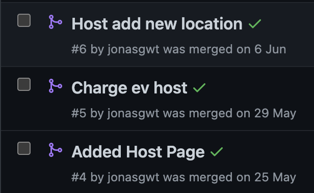

<!-- PROJECT LOGO -->
 

  
  

  
  

  
<h3 align="center">ChargeEV</h3>

  

    ChargeEV is an app that connects Electric Vehicle chargers with hosts that are willing to loan out their chargers.
     
    <a href="https://jonasgwt.github.io/ChargeEV/"><strong>Explore the docs »</strong></a>
     
     
    <a href="https://drive.google.com/file/d/1PxCbZpWghce-7rELC49nZX0rGvxPq9iz/view">Project Video</a>
    ·
    <a href="https://github.com/jonasgwt/ChargeEV/issues">Report Bug</a>
    ·

  

<!-- TABLE OF CONTENTS -->

  
Table of Contents

  <ol>
    <li><a href="#about-us">About Us</a></li>
    <li><a href="#about-the-project">About The Project</a></li>
    <ul>
        <li><a href="#aim">Aim</a></li>
      </ul>
      <ul>
        <li><a href="#motivation">Motivation</a></li>
      </ul>
      <ul>
        <li><a href="#key-features">Key Features</a></li>
      </ul>
      <ul>
        <li><a href="#target-audience">Target Audience</a></li>
      </ul>
    <li>
      <a href="#tech-stack">Tech Stack</a>
    </li>
    <li><a href="#demo">Demo</a></li>
    <li><a href="#user-stories">User Stories</a></li>
    <li><a href="#competitors">Competitors</a></li>
    <li><a href="#planning">Planning</a></li>
    <li><a href="#features">Features</a></li>
    <ul>
        <li><a href="#findacharge">FindACharge</a></li>
      </ul>
      <ul>
        <li><a href="#giveacharge">GiveACharge</a></li>
      </ul>
      <ul>
        <li><a href="#telegram-bot">Telegram Bot</a></li>
      </ul>
    <li><a href="#roadmap">Roadmap</a></li>
    <li><a href="#testing">Testing</a></li>
    <li><a href="#changes-from-the-initial-plan">Changes from the initial plan</a></li>
    <li><a href="#challenges">Challenges</a></li>
    <li><a href="#api-keys">API Keys</a></li>
    <li><a href="#other">Others</a></li>
  </ol>

<!-- Developers -->
## About Us

### Mila Tay 

* taymila1@gmail.com
* [![LinkedIn][LinkedIn.com]][Mila]
* [![Github][Github.com]][MilaGit]

### Jonas Goh 

* jongoh2000@gmail.com
* [![LinkedIn][LinkedIn.com]][Jonas]
* [![Github][Github.com]][JonasGit]

### Proposed Achivement Level

* Apollo

[Github.com]: https://img.shields.io/badge/GitHub-100000?style=for-the-badge&logo=github&logoColor=white
[MilaGit]: https://github.com/taymila
[Mila]: https://www.linkedin.com/in/tay-jiakang-mila-61a9bb146/
[Jonas]: https://www.linkedin.com/in/jonas-goh-891a15146/
[JonasGit]: https://github.com/jonasgwt

<!-- ABOUT THE PROJECT -->
## About The Project

  

### Aim

ChargeEV is a mobile-based application targeted towards EV users in large countries to
provide them with additional locations to charge their vehicles if superchargers are not
available in the current area.

### Motivation

Many countries have been shifting their focus to electric vehicles (EV) in recent years.
However, in many larger countries such as the United States (US) and Australia, electric
cars are seen as less superior compared to traditional petrol vehicles in terms of range
and convenience.
Due to its short range, many people are put off purchasing EVs as they cannot
travel out of large cities where superchargers are usually located. ChargEV aims to
solve this problem by enabling people to loan out chargers so that EV users can charge
anywhere, even in the most remote areas.
While apps on the market show EV chargers locations, it does not enable users to add
their chargers and rent them out. With outdoor chargers costing up to $15000, some
users might be unwilling to install them. Additionally, in rural areas, there might be a lack
of charging stations, and thus users will be able to share.

### Key Features

* ChargEV will consist of two sections, GetACharge and GiveACharge.
* GetACharge will consist of users looking to charge their EVs. Using their current
location, the app will find suitable chargers for the user, and they can then select
the preferred charge point depending on distance etc.
* GiveACharge will consist of hosts that provide users with charging points. Hosts
offer details such as an address, photos, charger type, available times,
instructions etc. Hosts can also have the option to charge users a chosen
amount. The app will provide a recommended cost for the host based on their
need to charge. Users will tentatively make payments through a QR code.

### Target Audience

* ChargEV will be targeting countries or areas that are more sparse where it is more difficult to locate
a charger
* Such areas include the rural areas in the United States
* We do not believe the host feature will be used significantly in Singapore due to the density of EV chargers present

(<a href="#top">back to top</a>)

## Tech Stack

### Built With

* ![Expo][expo.com]
* ![Javascript][js.com]
* ![Firebase][firebase.com]
* ![Google Cloud][googleCloud.com]
* ![Python][Python.com]
* ![Heroku][Heroku.com]
* ![Telegram][Telegram.com]

### Tools used

* ![Github][Github.com]
* ![Sheets][Sheets.com]
* ![Figma][Figma.com]

* Instagantt

### APIs used

* Google Maps SDK

* Google Places API

* Google Geocoding API
* Google Directions API
* Battuta Medunes Countries API
* The National Renewable Energy Laboratory (_NREL_) API
* News API

(<a href="#top">back to top</a>)

[expo.com]: https://img.shields.io/badge/Expo-1B1F23?style=for-the-badge&logo=expo&logoColor=white
[js.com]: https://img.shields.io/badge/JavaScript-323330?style=for-the-badge&logo=javascript&logoColor=F7DF1E
[firebase.com]: https://img.shields.io/badge/firebase-ffca28?style=for-the-badge&logo=firebase&logoColor=black
[googleCloud.com]: https://img.shields.io/badge/Google_Cloud-4285F4?style=for-the-badge&logo=google-cloud&logoColor=white
[Heroku.com]:  https://img.shields.io/badge/Heroku-430098?style=for-the-badge&logo=heroku&logoColor=white
[Python.com]: https://img.shields.io/badge/Python-FFD43B?style=for-the-badge&logo=python&logoColor=blue
[Telegram.com]: https://img.shields.io/badge/Telegram-2CA5E0?style=for-the-badge&logo=telegram&logoColor=whit
[Github.com]: https://img.shields.io/badge/GitHub-100000?style=for-the-badge&logo=github&logoColor=white
[Sheets.com]: https://img.shields.io/badge/Google%20Sheets-34A853?style=for-the-badge&logo=google-sheets&logoColor=white
[Figma.com]: https://img.shields.io/badge/Figma-F24E1E?style=for-the-badge&logo=figma&logoColor=white
[LinkedIn.com]: https://img.shields.io/badge/LinkedIn-0077B5?style=for-the-badge&logo=linkedin&logoColor=white

<!-- Testing -->

## Demo

The App has **only been optimised for IOS**.

To start, download the ExpoGo app and scan the following QR code (In the Camera App)
Contact Mila @MilaTayJK (Telegram) should you have any issues

  
  

**Note:** When testing on Expo Go, background location is not available

Alternatively, you can also test on iPhone Simulator <a href="https://drive.google.com/drive/folders/1GC19YGHUu1QHnV6HoAdkamiN6RMGNjQn?usp=sharing">here</a>

(<a href="#top">back to top</a>)

## User Stories

### User

* As a user, I want to be able to book a charger so that I can charge a car

* As a user, I want to find chargers near me so that I don't have to drive far

* As a user, I want to reset my password so that I can recover my account
* As a user, I want to navigate the app easily so that I can access features easily
* As a user, I want to find non-ChargeEV chargers so that I can find the nearest charger
* As a user, I want to cancel a booking so that I will be able to rebook

### Host

* As a host, I want to list my charger so that I can loan it out

* As a host, I want to have a payment method, so that I can receive payment

* As a host, I want to update my listings so that I can update any errors
* As a host, I want to know when the user is approaching, so that I can check to confirm the payment
* As a host, I want to report a user so that I can prevent this from occurring again

1. Hosts can provide EV chargers at fixed prices (the app will provide an estimated cost). The host will seek to lend their chargers when they are not using them.

2. Users can find and select their preferred locations and suitable chargers within the area. As a user, I might be unable to find chargers near me, especially if there is no well-developed EV network in my country.

3. As administrators, we will seek to reduce predatory behaviour such as price gouging. This can be done by informing users if they are overpaying.

## Competitors

### Current competition

* We have not identified an app that implements the same ideas as ours.

* There are apps that allow the locating of chargers in general, we are aware of such apps. We have allowed for the non-ChargeEV chargers to be shown as well as this will attract more users to the app

### Plans

* One drawback is that our app requires sign-ups which could hold back potential users

* A way is to create a mode which allows for non-signed up users to use the app, however CRM methods will have to be thought off to encourage them to sign up

* We have an advantage without many competitors, this also means the market share is likely to be small. There will have to be a greater drive to increase the potential market.

(<a href="#top">back to top</a>)

<!-- USAGE EXAMPLES -->

## Planning

### Mockups

App Mockup: [Figma](https://www.figma.com/file/BozibW7ZR0EI4SWFEHyQCm/ChargeEV).

### Log-in and Charging map view

  
  

### User profile display

  

### Edit Profile Planned Flow

  

### Adding Charger Process

  

  

(<a href="#top">back to top</a>)

### User flow

  

### Database structure

  

(<a href="#top">back to top</a>)

<!-- FEATURE -->

## Features

### FindACharge

ChargeEV users can find public chargers hosted by other companies and ChargeEV chargers hosted by other users in a 50km radius.
Information about these public chargers is received from the Google Places API, taking into account opening hours and charger functionality.
ChargeEV chargers are hosted by other ChargeEV users, renting out their home chargers for a small fee. Unlike public chargers, ChargeEV chargers charge users based on a per charge basis.
On load, results of all the chargers are displayed to the users arranged from nearest to furthest, with an option for them to sort by cheapest or filter by charger type.

**Searching of chargers**

Searching of public chargers is done by making an API call to Google Places API in the `nearbySearch` mode with the keyword "chargers".
Searching for ChargeEV location is done by taking the precomputed geohash and making a geo query. However, as documented <a href="https://firebase.google.com/docs/firestore/solutions/geoqueries">here</a>, we experienced false positives and had to do a check to eliminate them. This was a time-consuming operation, and to reduce loading time, we used firebase indexing to index our database, making the search faster.

**Booking Public Chargers**

Upon booking of a public charger location, the user will be redirected to their preferred maps for navigation, and the booking will not be recorded.

**Booking ChargeEV Chargers**

Upon booking a ChargeEV charger location, the host will be informed, and the user location will be shared live with the host. The charger location will also be set to unavailable, so other users will not be able to book it.
We will also create a geofence of a 50m radius of the charger location with `startGeofencingAsync()`. Upon entry of the geofenced region, the host will be informed, and the user will not be able to cancel the booking.
After the user has completed the charge, they will have to verify with us that they have made their payment.
If they did not do so and leave the geofenced region, we will send them a notification or/and an alert to remind them to verify the payment.

**Live Location Tracking**

During the booking process, the user location will be updated with `startLocationUpdatesAsync()` to firebase.
The host will be able to view user location by receiving coordinates from firebase. This update is done at every 5s interval.
Upon arriving at the location, we will immediately stop the location update with `stopLocationUpdatesAsync()`. The live tracking page for hosts will also close.

**Background Location Tracking**

We have also used background location tracking to retrieve users' location when they make their way to a charger location during a booking, even when their app is closed.
If the user does not allow for background tracking, during the live tracking page, hosts will be informed that the location of the user might not be updated.

 

**Note:** As we do not have information on charger types and pricing for public chargers, filtering by charger type or sorting by cheapest will not display any public chargers.

**ChargeEV Chargers / Public Chargers:**

  
  

### GiveACharge

This enables individuals or companies to loan out their chargers for a small fee.

**Hosting a Charger Location**

Hosting is done in a simple 6-step process, requiring users to input their location details step-by-step, to not further complicate the process and discourage users from hosting.
A progress bar is also displayed at the bottom to allow users to gauge their process.

**Pricing**

Pricing is based on a per charge basis. To help users better decide on a price, we have used the NREL API to provide electricity cost data to hosted locations in the United States. This is done by first receiving the address of the hosted location, and by using the Google Geocoding API, we get the coordinates of the hosted location, and with it make a call to the NREL API to get /kwh electricity costs. With this, we can give users an estimate of the cost of charging an average EV. On top of that, we also provide users with prices of nearby ChargeEV charger locations within a 50km radius to help them price their location competitively.

**Payment**

We have two payment methods available, cash and QR code. For cash, hosts must be at the charger location to receive the payment during a booking. For QR code, hosts have to display a QR code for users to scan to make their payments. Hosts can choose which payment method they want to make available for their customers.

Hosts can choose which payment method(s) they accept on the "Manage Payment Information" page. Additionally, when adding a location, hosts can choose which payment method(s) they accept for each charger location, allowing them to have the option to choose different payment methods for different charger locations they host.

**Booking**

Upon booking, hosts will be notified that their charger location is booked, and they can track the user location live. Details on how it works are found above in the FindACharge section. After the booking is complete and the user has made payment, the host has to verify that they have received the Payment before the booking is closed.

**Address**

During the address stage, we used the Google Geocoding API to ensure that the location that the user input was valid. This is done by making a query with the address the user provided, and the API will then return a postal code or an error. If the postal code does not match or there is an error, we will display an alert. On the other hand, if the address is valid, we will convert the location address to coordinates and placeID. We will also hash the location and save the geohash and the other information in firebase.

**Edit Locations**

Hosts can also edit details about their location or remove the location. For example, if the host does not want their charger to be available for rent for a period of time, they can set it to "In Use", and their charger would not be booked. Note that hosts will not be able to change the availability of their charger when the location is in an active booking.

**Setting up:**

  

### Telegram Bot

To provide a more interactive support experience. The telegram bot is created to help users troubleshoot issues they face.
Video aids are used in the bot to help users have a visual experience.
It is supported by Heroku backend to ensure that we do not need to keep our server running.

TelegramBot

  

(<a href="#top">back to top</a>)

<!-- ROADMAP -->

## Roadmap

### Planning

* For our planning, we employed Agile. We broke our App features into smaller deliverables. Within the 3 months period, we worked on each feature by:
* Planning -> Design -> Code -> Test -> Reflect
* This allowed for us to work fast and build our product feature by feature. With Agile, we do not need to spend excessive amount of time to debug and test.
* Our roadmap was adjusted when we realised we were unable to meet deadlines
* We used product management tools such as instagantt to distribute work and better picture our roadmap

Refer to the development plan

Plan: [Instagantt](https://app.instagantt.com/shared/s/kY9oAKAc2ID3k56JL8l7/latest)

<!-- Testing -->
## Testing

* We have carried out unit tests. All documentation can be found on google sheets.
* To conduct unit tests, we have identified our key features. We then broke down it into specific steps and tested them
* We tested core features internally and after that, we requested the help of peers to do testing and provide feedback to us on the product so far.
* We have also collected textual feedback via Google Forms and a visualisation of the positive and negative feedback can be seen on our poster.
* The feedback was collected during the acceptance testing stage of our app
* We have documented bugs that we have resolved. This helps us to understand if previously solved bugs were not squashed successfully
* Should similar bugs keep happening, there could be underlying problems that require more than a simple fix

Testing: [Google Sheets](https://docs.google.com/spreadsheets/d/1lI6qObjsvcQ8hcxTFgI2hN9g1sCO6TRdgVF5pagoI_w/edit?usp=sharing)

<!-- Testing -->
### Conclusions from Testing

* For internal and unit tests, the issues that arose are mainly technical in nature, where features fail because they do not behave as intended.

* For the external test, issues that were raised were regarding user experience. For instance, the lack of a back button etc. Some other issues include "good to have features" that were overlooked by us during our planning.

## Git Workflow

As we split the work by features, most of the time, we will be working on different components simultaneously. This is done by making use of branches in Github.

For instance, person A is working on Host features for the app, while person B is working on the ChargeMap features. We will create two separate branches, and persons A and B will work on their respective branches.

After we are done with creating our assigned feature, we will then merge with the master branch. Should there be any conflicts, we will review the conflicted code together.

<!-- Deviations from initial plan -->
## Changes from the initial plan

* While we initially wanted to use our backend with MySQL, we found that Firebase suited our backend better as it allowed for user authentication and also data storage

* We also decided to add a telegram bot to value add to our product. The FAQ was generated from feedback during our initial round of UAT.

* We have also decided to not support android devices. Although basic functionality is available on android devices, there are many styling issues that we were not able to fix, as it would entail a significant redesign. You can read more in the challenges section point 5.

(<a href="#top">back to top</a>)

## Challenges

1. We had trouble with initially using our own server to host the database and user data due to unreliable read-write occuring

* We solved this by using google firebase and learning the API to understand how to use it to manage our app data

2. We initially had a basic page meant for user support. However, after milestone 1 and during external UAT, we received feedback that it was not interactive and provided little assistance to our users.

* Thus we decided to create a chatbot. We decided to use telegram as there is good support for python using the API. We had difficulty finding a server to host our chatbot that was reliable. We tried using google cloud, however, it had issues starting up after not using the bot for a few hours. Thus we used heroku which works well and suits out needs

3. We are facing the challenge of bandwidth limitation with firebase for loading images.

* We have calculated the rough cost of firebase with approximately 5000 users a day at 1 hour. The approximate cost will be $50-$100. For testing, we temporarily disabled the display of images so that we can save up on bandwidth.

4. As we do not have experience with UI/UX, we faced difficulty in creating an app that looks nice and is easy to use.

* We took inspiration from apps such as Airbnb and Grab when planning out our app design.

5. Android Compatibility

* Throughout most of the project we have been testing on IOS simulators, as such, we have overlooked the aspect of android compatibility. Furthermore, we experience severe lag when testing on android simulators. With the help of some of our friends with android devices, we have fixed some of the problems, and now all basic features on android should work. However, there are still many styling issues, where fonts don't load in or some animations do not work. As fixing such issues would mean a significant redesign, we have decided to focus our efforts on perfecting the IOS version instead.

6. Long loading times when searching for chargers

* Since MS2, we have significantly reduced the loading time when searching for chargers. To reduce searching time, we made use of Firebase indexing, to index the chargers based on their geohash, to have faster queries.

* Another cause for the slow loading time is because of the getting of the user location. Originally we used `getCurrentPositionAsync()`, however, which contributed to a couple of seconds to the loading time. Instead, now, we used `getLastKnownPositionAsync()`, which can receive user location almost immediately.

(<a href="#top">back to top</a>)

<!-- Contributing -->
## API Keys

All API keys used are located in firebase/firebase-config.js. You can create an API key using the following links:

* <a href="https://console.cloud.google.com/freetrial?_ga=2.230362654.38470480.1658741246-653910720.1658741243">Google Cloud Console </a>
* <a href="https://developer.nrel.gov/signup/">NREL API</a>
* <a href="https://battuta.medunes.net/">Bettuta Medunes</a>
* <a href="https://newsapi.org/">News API</a>

(<a href="#top">back to top</a>)

## Future Features

Due to our limited time, we cannot develop several features that will further improve the app.

* View Booking History Feature
* Android Compatibility
* Chat Feature

There are also several features that we want to develop but are unable to due to the lack of a reliable API.

* Charging users by kwh   There are APIs that allow us to track how much by kwh a user used at the charging station. However, not every EV company has an API, and there isn't one API that can be used for all EVs. For now, only Tesla has an API that allows such tracking as seen <a href="https://www.teslaapi.io/">here</a>

* Providing charger type and price information for public chargers  
We could not find a reliable API that provides such comprehensive information for public chargers worldwide.

<!-- ACKNOWLEDGMENTS -->
## Other

* Should you have suggestions for features please open an <a href="https://github.com/jonasgwt/ChargeEV/issues">issue</a>

(<a href="#top">back to top</a>)

